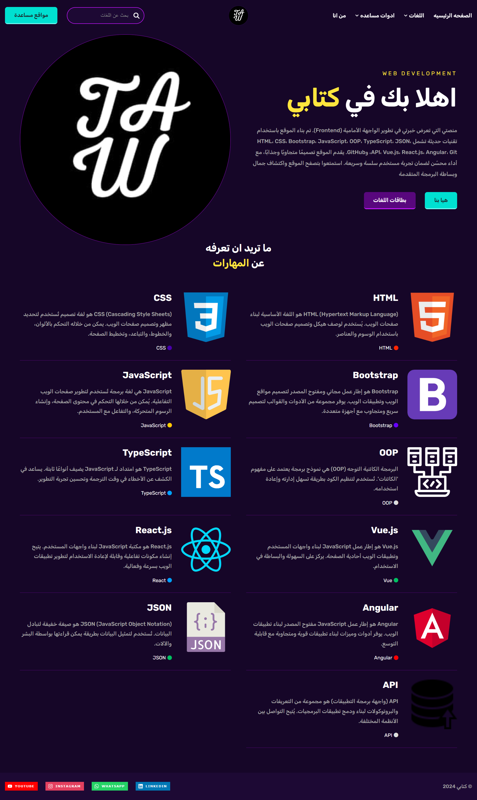

<h1 align="right">كتابي</h1>

    مرحبًا بكم في "Book Me"، منصتي التي تعرض خبرتي في تطوير الواجهة الأمامية (Frontend). تم بناء الموقع باستخدام تقنيات حديثة تشمل HTML، CSS، Bootstrap، JavaScript، OOP، TypeScript، JSON، API، Vue.js، React.js، Angular، Git، وGitHub. يقدم الموقع تصميمًا متجاوبًا وجذابًا، مع أداء محسّن لضمان تجربة مستخدم سلسة وسريعة. استمتعوا بتصفح الموقع واكتشاف جمال وبساطة البرمجة المتقدمة.

<h1 align="right">مهارات:</h1>

  
  
  
  
    
  

<h2>لقطات العرض التجريبي</h2>
